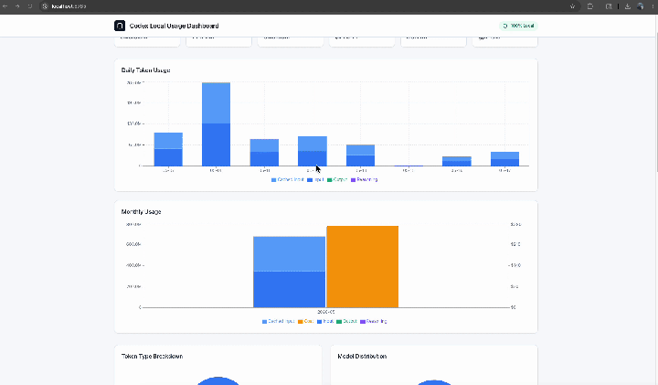

# Codex Usage Dashboard

> 本地可视化 Codex 用量，一键导出 AI-Native 工程报告。

**面试时别再空口说"我很会用 AI"了——直接把数据拍桌上。**



## 这东西能干啥

面试官问 "说说你怎么用 AI 辅助开发？"

以前你只能嘴上说"我经常用 Codex"，现在你可以打开这个仪表盘，把 ** lifetime tokens、峰值用量、最常用模型** 截个图或者贴一段 Markdown 进简历。

它只读你本地的 `~/.codex/sessions`，在浏览器里跑，不上传、不联网、不要 API Key。

> **Privacy First** —— 你的 prompt、代码、数据，全留在本地。

## 四行命令跑起来

```bash
git clone https://github.com/7oru/codex-usage-dashboard.git
cd codex-usage-dashboard
npm install
npm run export:data   # 扫描 ~/.codex/sessions
npm run dev           # http://localhost:5173
```

不想开服务？直接打包成静态 HTML，双击就能看：

```bash
npm run build
open dist/index.html
```

## 面试/作品集数据示例

点仪表盘里的 **Download Markdown Report**，自动生成下面这种报告。复制粘贴到 GitHub Profile README、作品集网站或者牛客/知乎帖子都行：

```markdown
# Codex Usage Report

> Generated at 2026-05-19
> Data source: local `~/.codex/sessions`

## Overview

- **Lifetime Tokens**: 346.9M
- **Estimated Cost**: $270.71
- **Most Active Day**: 2026-05-08 (132.0M tokens)
- **Average Daily Usage**: 69.3M
- **Most Used Model**: gpt-5.5

## Daily Breakdown

| Date       | Input   | Cached  | Output  | Reasoning | Total   | Cost   |
|------------|---------|---------|---------|-----------|---------|--------|
| 2026-05-08 | 131.4M  | 124.2M  | 575.2k  | 222.9k    | 132.0M  | $91.24 |
| ...        | ...     | ...     | ...     | ...       | ...     | ...    |
```

**效果**：别人还在写 "熟练使用 AI 编程"，你的简历里直接印着 346.9M tokens。

## 功能一览

- **100% 本地运行** —— 零上传、零配置、零 API Key
- **回溯历史** —— 把以前所有的 Codex 会话一次性可视化
- **多维图表** —— 日/月维度 + input/output/reasoning/cached 拆分
- **Token 明细** —— 饼图看模型占比、看 token 类型分布
- **Markdown 导出** —— 一键生成可粘贴的报告
- **多 Agent 预留** —— 已预留 `~/.claude`、`~/.cursor` 接入能力

## 数据从哪来

```
~/.codex/sessions
        ↓
  ccusage --json
        ↓
public/data/{daily,monthly,session}.json
        ↓
   浏览器里的 React 仪表盘
```

## 目录结构

```
codex-usage-dashboard/
├── scripts/
│   ├── export-ccusage-json.sh   # 导出 ccusage JSON
│   └── build.sh                 # 生产构建 (esbuild + tailwindcss)
├── public/
│   └── data/                    # 生成的数据 (gitignored)
│       └── .gitkeep
├── src/
│   ├── App.tsx
│   ├── main.tsx
│   ├── types.ts
│   ├── global.d.ts              # Window.__CODEX_DATA__ 类型声明
│   ├── hooks/
│   │   └── useCodexData.ts      # 数据获取 + 手动上传（含 JSON 校验）
│   ├── components/
│   │   ├── StatsCards.tsx       # 概览卡片
│   │   ├── DailyChart.tsx       # 每日堆叠柱状图
│   │   ├── MonthlyChart.tsx     # 月度柱状图 + 费用
│   │   ├── TokenBreakdown.tsx   # Token 类型 & 模型饼图
│   │   ├── SessionTable.tsx     # 可排序 / 可展开的会话列表
│   │   └── ExportMarkdown.tsx   # Markdown 报告导出
│   └── utils/
│       └── format.ts            # 共享数字格式化
├── package.json
├── tailwind.config.js
└── README.md
```

## 构建与部署

### 开发

```bash
npm run dev           # Vite + HMR
```

### 生产

```bash
npm run build         # 输出 dist/，纯静态文件
```

产物可以丢到任何静态托管：

```bash
# 本地预览
open dist/index.html

# 或丢到 GitHub Pages / Vercel / Netlify / Nginx
```

> `scripts/build.sh` 用 esbuild + Tailwind CSS CLI 打包，构建时会直接把 JSON 数据内联进 HTML。所以 `dist/index.html` 可以直接双击打开，不需要起服务。

## 手动导入数据

不想跑脚本？手动生成 JSON 也行：

```bash
npx ccusage@latest codex daily --json > public/data/codex-daily.json
npx ccusage@latest codex monthly --json > public/data/codex-monthly.json
npx ccusage@latest codex session --json > public/data/codex-session.json
```

然后直接把 JSON 文件拖进页面。

## 换其他 Agent

```bash
AGENT=claude npm run export:data
AGENT=cursor npm run export:data
```

或者改 `scripts/export-ccusage-json.sh` 加更多 Agent。

## 这个项目是怎么写的

本项目本身就是 **AI-Native 开发** 的实验场。

- **ChatGPT (GPT-5.5 / Codex)** —— 架构设计、需求拆解、方案评审、Code Review
- **Kimi CLI (2.6)** —— 写代码、跑构建、修 bug

整个流程刻意拆成三步：

1. **规划 / 推理**（ChatGPT / Codex）
2. **执行 / 实现**（Kimi CLI）
3. **Code Review & 迭代**（ChatGPT / Codex）

用来探索真实工程里的多 Agent 协作模式。

## 技术栈

- [Vite](https://vitejs.dev/) + [React](https://react.dev/) + [TypeScript](https://www.typescriptlang.org/)
- [Tailwind CSS](https://tailwindcss.com/)
- [Recharts](https://recharts.org/)
- [ccusage](https://www.npmjs.com/package/ccusage)

## License

MIT
